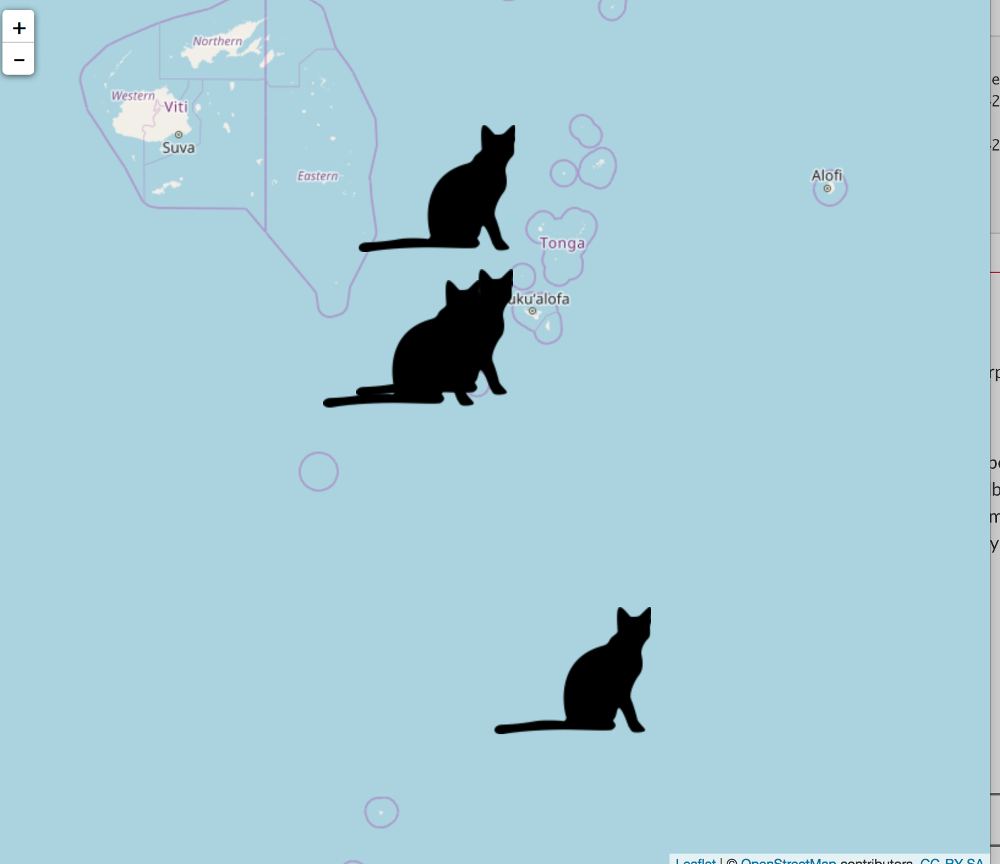

# rphylopic 

[](http://www.repostatus.org/#active)
[](https://travis-ci.org/sckott/rphylopic)
[](https://codecov.io/github/sckott/rphylopic?branch=master)
[](https://github.com/metacran/cranlogs.app)
[](https://cran.r-project.org/package=rphylopic)


The idea here is to create modular bits and pieces to allow you to add silhouettes to not only ggplot2 plots, but base plots as well. Some people prefer base plots while others prefer ggplot2 plots (me!), so it would be nice to have both options.

+ Phylopic website: <http://phylopic.org/>
+ Phylopic development documentation: <http://phylopic.org/api/>

## Install

CRAN version


```r
install.packages("rphylopic")
```

Development version


```r
install.packages("remotes")
remotes::install_github("sckott/rphylopic")
```


```r
library('rphylopic')
```

## Work with names

Find the taxa in Phylopic whose names match some text


```r
person <- name_search(text = "Homo sapiens", options = "namebankID")[[1]]
```

Get info on a name


```r
# no options just returns the UUID (aka: self)
name_get(uuid = person$uid[1])
#> $uid
#> [1] "1ee65cf3-53db-4a52-9960-a9f7093d845d"
# specify fields to return with the `options` parameter
name_get(uuid = person$uid[1], options = c('citationStart', 'html'))
#> $html
#> [1] "<span class=\"nomen\"><span class=\"scientific\">Homo sapiens</span> <span class=\"citation\">Linnaeus, 1758</span></span>"
#> 
#> $citationStart
#> [1] 13
#> 
#> $uid
#> [1] "1ee65cf3-53db-4a52-9960-a9f7093d845d"
```

Searches for images for a taxonomic name.


```r
name_images(uuid = person$uid[1])
#> $other
#> list()
#> 
#> $supertaxa
#> list()
#> 
#> $subtaxa
#> list()
#> 
#> $same
#> $same[[1]]
#> $same[[1]]$uid
#> [1] "c089caae-43ef-4e4e-bf26-973dd4cb65c5"
#> 
#> 
#> $same[[2]]
#> $same[[2]]$uid
#> [1] "ad736445-7147-46f0-9932-d69243dea8f0"
#> 
#> 
#> $same[[3]]
#> $same[[3]]$uid
#> [1] "a146bf1b-c94d-46e1-9cd8-a0ac52a1e0a9"
```

Find the minimal common supertaxa for a list of names.


```r
insect <- name_search('Orussus abietinus')[[1]]
bird <- name_search('Malacoptila panamensis')[[1]]
(x <- name_minsuptaxa(uuid = c(person$uid[1], insect$uid, bird$uid))[[1]])
#> $canonicalName
#> $canonicalName$uid
#> [1] "68226175-f88d-4ea8-8228-3204c49bfda0"
name_get(x$canonicalName$uid, options = c('string'))
#> $uid
#> [1] "68226175-f88d-4ea8-8228-3204c49bfda0"
#> 
#> $string
#> [1] "Nephrozoa Jondelius & al. 2002"
```

Collect taxonomic data for a name.


```r
name_taxonomy(uuid = "f3254fbd-284f-46c1-ae0f-685549a6a373", 
  options = "string", as = "list")
#> $taxa
#> $taxa[[1]]
#> $taxa[[1]]$canonicalName
#> $taxa[[1]]$canonicalName$uid
#> [1] "f3254fbd-284f-46c1-ae0f-685549a6a373"
#> 
#> $taxa[[1]]$canonicalName$string
#> [1] "Macrauchenia patachonica Owen 1838"
#> 
#> 
#> 
#> 
#> $uBioCommands
#> [1] FALSE
#> 
#> $inclusions
#> list()
```

## Work with name sets

Retrieves information on a set of taxonomic names.


```r
id <- "8d9a9ea3-95cc-414d-1000-4b683ce04be2"
nameset_get(uuid = id, options = c('names', 'string'))
#> $uid
#> [1] "8d9a9ea3-95cc-414d-1000-4b683ce04be2"
#> 
#> $names
#> $names[[1]]
#> $names[[1]]$uid
#> [1] "105d17a4-9706-4fd5-85d7-becffaf6250a"
#> 
#> $names[[1]]$string
#> [1] "Homo sapiens sapiens Linnaeus 1758"
#> 
#> 
#> $names[[2]]
#> $names[[2]]$uid
#> [1] "9dc78907-02ca-4e98-95d7-f5a7c6166ee8"
#> 
#> $names[[2]]$string
#> [1] "Canis familiaris familiaris"
```

Collects taxonomic data for a name.


```r
nameset_taxonomy(uuid = "8d9a9ea3-95cc-414d-1000-4b683ce04be2", options = "string")$taxa[1:2]
#> [[1]]
#> [[1]]$canonicalName
#> [[1]]$canonicalName$uid
#> [1] "2265ff9d-cfcf-4bf4-9f3e-fb4dd9e90261"
#> 
#> [[1]]$canonicalName$string
#> [1] "Choanozoa"
#> 
#> 
#> 
#> [[2]]
#> [[2]]$canonicalName
#> [[2]]$canonicalName$uid
#> [1] "b909eda2-4a6d-4d87-a463-87cbe3d20c5f"
#> 
#> [[2]]$canonicalName$string
#> [1] "Coelomata"
```

## Work with images

Get info on an image


```r
id <- "9fae30cd-fb59-4a81-a39c-e1826a35f612"
image_get(uuid = id)
#> $uid
#> [1] "9fae30cd-fb59-4a81-a39c-e1826a35f612"
```

Count images in Phylopic database


```r
image_count()
#> [1] 3564
```

Lists images in chronological order, from most to least recently modified


```r
image_list(start=1, length=2)
#> [[1]]
#> [[1]]$uid
#> [1] "78dbe564-bcba-4dc3-8bdc-fb95fc288580"
#> 
#> 
#> [[2]]
#> [[2]]$uid
#> [1] "cbfc59ab-55c1-4296-9d9f-c8791894fbbb"
```

Lists images within a given time range, from most to least recent


```r
image_timerange(from="2013-05-11", to="2013-05-12", options='credit')[1:2]
#> [[1]]
#> [[1]]$credit
#> [1] "Emily Willoughby"
#> 
#> [[1]]$uid
#> [1] "58daaa49-e699-448d-9553-ceedd1fc98a4"
#> 
#> 
#> [[2]]
#> [[2]]$credit
#> [1] "Gareth Monger"
#> 
#> [[2]]$uid
#> [1] "303ddff0-6a51-4f70-adf7-69bb22385d6d"
```

## Work with uBio data


```r
ubio_get(namebankID = 109086)
#> $uid
#> [1] "1ee65cf3-53db-4a52-9960-a9f7093d845d"
```

## Plot a silhouette behind a plot


```r
library('ggplot2')
img <- image_data("27356f15-3cf8-47e8-ab41-71c6260b2724", size = "512")[[1]]
qplot(x = Sepal.Length, y = Sepal.Width, data = iris, geom = "point") +
  add_phylopic(img)
```


## Plot images as points in a plot

For `ggplot2` graphics...


```r
library('ggplot2')
img <- image_data("c089caae-43ef-4e4e-bf26-973dd4cb65c5", size = "64")[[1]]
p <- ggplot(mtcars, aes(drat, wt)) +
      geom_blank() +
      theme_grey(base_size = 18)
for (i in 1:nrow(mtcars)) {
  p <- p + add_phylopic(img, 1, mtcars$drat[i], mtcars$wt[i], ysize = 0.3)
}
p
```


and the same plot in base R graphics:


```r
cat <- image_data("23cd6aa4-9587-4a2e-8e26-de42885004c9", size = 128)[[1]]
posx <- runif(50, 0, 1)
posy <- runif(50, 0, 1)
size <- runif(50, 0.01, 0.2)
plot(posx, posy, type = "n", main = "A cat herd")
for (i in 1:50) {
  add_phylopic_base(cat, posx[i], posy[i], size[i])
}
```


## Save png to disk


```r
cat <- image_data("23cd6aa4-9587-4a2e-8e26-de42885004c9", size = 128)[[1]]
out <- save_png(cat)
identical(png::readPNG(out), cat)
#> TRUE
```

## Use silhouettes as icons in Leaflet plots

There's nothing baked into `rphylopic` for this, but here's an example of how to do it.


```r
library(leaflet)
data(quakes)

# get an image
cat <- image_data("23cd6aa4-9587-4a2e-8e26-de42885004c9", size = 128)[[1]]
# save to disk
file <- save_png(cat)
# make an icon. this one is super simple, see `makeIcon` docs for more options
sil_icon <- makeIcon(iconUrl = file)

# make the plot
leaflet(data = quakes[1:4,]) %>% addTiles() %>%
  addMarkers(~long, ~lat, icon = sil_icon)
```




## Meta

* Please [report any issues or bugs](https://github.com/sckott/rphylopic/issues).
* License: MIT
* Get citation information for `rphylopic` in R doing `citation(package = 'rphylopic')`
* Please note that this project is released with a [Contributor Code of Conduct](CODE_OF_CONDUCT.md).
By participating in this project you agree to abide by its terms.
