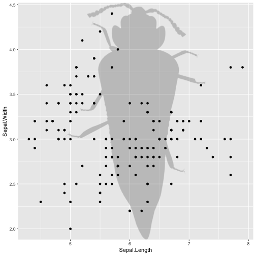

rphylopic
=========

The idea here is to create modular bits and pieces to allow you to add
silhouettes to not only ggplot2 plots, but base plots as well. Some
people prefer base plots while others prefer ggplot2 plots (me!), so it
would be nice to have both options.

-   Phylopic website: [<http://phylopic.org/>](http://phylopic.org/)
-   Phylopic development documentation:
    [<http://phylopic.org/api/>](http://phylopic.org/api/)
-   Check out the wrapper for Python by Ben Morris
    [here](https://github.com/bendmorris/python-phylopic)

Quick start
-----------

### Install

    install_github("devtools")
    devtools::install_github("sckott/rphylopic")

    library('rphylopic')

### Work with names

Get info on a name

    id <- "1ee65cf3-53db-4a52-9960-a9f7093d845d"
    name_get(uuid = id)
    #> $uid
    #> [1] "1ee65cf3-53db-4a52-9960-a9f7093d845d"
    name_get(uuid = id, options = c('citationStart', 'html'))
    #> $html
    #> [1] "Homo sapiens Linnaeus, 1758"
    #> 
    #> $citationStart
    #> [1] 13
    #> 
    #> $uid
    #> [1] "1ee65cf3-53db-4a52-9960-a9f7093d845d"

Searches for images for a taxonomic name.

    name_images(uuid = "1ee65cf3-53db-4a52-9960-a9f7093d845d")
    #> $other
    #> list()
    #> 
    #> $supertaxa
    #> list()
    #> 
    #> $subtaxa
    #> list()
    #> 
    #> $same
    #> $same[[1]]
    #> $same[[1]]$uid
    #> [1] "c089caae-43ef-4e4e-bf26-973dd4cb65c5"
    #> 
    #> 
    #> $same[[2]]
    #> $same[[2]]$uid
    #> [1] "a146bf1b-c94d-46e1-9cd8-a0ac52a1e0a9"

Find the minimal common supertaxa for a list of names.

    name_minsuptaxa(uuid=c("1ee65cf3-53db-4a52-9960-a9f7093d845d", "08141cfc-ef1f-4d0e-a061-b1347f5297a0"))
    #> [[1]]
    #> [[1]]$canonicalName
    #> [[1]]$canonicalName$uid
    #> [1] "b44e3b2e-3f21-4583-a760-59ec9d9f04d7"

Find the taxa whose names match a piece of text.

    name_search(text = "Homo sapiens", options = "namebankID")[[1]]
    #> [1] 1ee65cf3-53db-4a52-9960-a9f7093d845d
    #> [2] 1558d4cc-4574-4709-89b6-7a0ce26d3c52
    #> [3] 9fee81c4-1a7d-44e6-999f-f2442b99a9db
    #> [4] 47fd19a7-8d1c-417d-b913-8f53a96d03d5
    #> [5] 15444b9c-f17f-4d6e-89b5-5990096bcfb0
    #> [6] 505a0c47-b849-4f9e-bd05-d27ef23ef4bd
    #> [7] aeba17e8-ec59-4283-9da9-a520a34a7bf2
    #> [8] 105d17a4-9706-4fd5-85d7-becffaf6250a
    #> [9] d88164ec-3152-444b-b41c-4757a344a764
    #> 9 Levels: 1ee65cf3-53db-4a52-9960-a9f7093d845d ...

Collects taxonomic data for a name.

    name_taxonomy(uuid = "f3254fbd-284f-46c1-ae0f-685549a6a373", options = "string", as = "list")
    #> $taxa
    #> $taxa[[1]]
    #> $taxa[[1]]$canonicalName
    #> $taxa[[1]]$canonicalName$uid
    #> [1] "f3254fbd-284f-46c1-ae0f-685549a6a373"
    #> 
    #> $taxa[[1]]$canonicalName$string
    #> [1] "Macrauchenia patachonica Owen 1838"
    #> 
    #> 
    #> 
    #> 
    #> $uBioCommands
    #> [1] FALSE
    #> 
    #> $inclusions
    #> list()

### Work with name sets

Retrieves information on a set of taxonomic names.

    id <- "8d9a9ea3-95cc-414d-1000-4b683ce04be2"
    nameset_get(uuid = id, options = c('names', 'string'))
    #> $uid
    #> [1] "8d9a9ea3-95cc-414d-1000-4b683ce04be2"
    #> 
    #> $names
    #> $names[[1]]
    #> $names[[1]]$uid
    #> [1] "105d17a4-9706-4fd5-85d7-becffaf6250a"
    #> 
    #> $names[[1]]$string
    #> [1] "Homo sapiens sapiens Linnaeus 1758"
    #> 
    #> 
    #> $names[[2]]
    #> $names[[2]]$uid
    #> [1] "9dc78907-02ca-4e98-95d7-f5a7c6166ee8"
    #> 
    #> $names[[2]]$string
    #> [1] "Canis familiaris familiaris"

Collects taxonomic data for a name.

    nameset_taxonomy(uuid = "8d9a9ea3-95cc-414d-1000-4b683ce04be2", options = "string")$taxa[1:2]
    #> [[1]]
    #> [[1]]$canonicalName
    #> [[1]]$canonicalName$uid
    #> [1] "2265ff9d-cfcf-4bf4-9f3e-fb4dd9e90261"
    #> 
    #> [[1]]$canonicalName$string
    #> [1] "Choanozoa"
    #> 
    #> 
    #> 
    #> [[2]]
    #> [[2]]$canonicalName
    #> [[2]]$canonicalName$uid
    #> [1] "b909eda2-4a6d-4d87-a463-87cbe3d20c5f"
    #> 
    #> [[2]]$canonicalName$string
    #> [1] "Coelomata"

### Work with images

Get info on an image

    id <- "9fae30cd-fb59-4a81-a39c-e1826a35f612"
    image_get(uuid = id)
    #> $uid
    #> [1] "9fae30cd-fb59-4a81-a39c-e1826a35f612"

Count images in Phylopic database

    image_count()
    #> [1] 2243

Lists images in chronological order, from most to least recently
modified

    image_list(start=1, length=2)
    #> [[1]]
    #> [[1]]$uid
    #> [1] "7d36a10c-43ff-41c5-a939-f3fd203d419c"
    #> 
    #> 
    #> [[2]]
    #> [[2]]$uid
    #> [1] "e401eed5-29f1-42c8-abbd-1f18134734f6"

Lists images within a given time range, from most to least recent

    image_timerange(from="2013-05-11", to="2013-05-12", options='credit')[1:2]
    #> [[1]]
    #> [[1]]$credit
    #> [1] "Emily Willoughby"
    #> 
    #> [[1]]$uid
    #> [1] "58daaa49-e699-448d-9553-ceedd1fc98a4"
    #> 
    #> 
    #> [[2]]
    #> [[2]]$credit
    #> [1] "Gareth Monger"
    #> 
    #> [[2]]$uid
    #> [1] "303ddff0-6a51-4f70-adf7-69bb22385d6d"

### Work with uBio data

    ubio_get(namebankID = 109086)
    #> $uid
    #> [1] "1ee65cf3-53db-4a52-9960-a9f7093d845d"

### Plot a silhouette behind a plot

    library('ggplot2')
    img <- image_data("27356f15-3cf8-47e8-ab41-71c6260b2724", size = "512")[[1]]
    qplot(x=Sepal.Length, y=Sepal.Width, data=iris, geom="point") + 
      add_phylopic(img)

### Plot images as points in a plot

For `ggplot2` graphics...

    library('ggplot2')
    img <- image_data("c089caae-43ef-4e4e-bf26-973dd4cb65c5", size = "64")[[1]]
    p <- ggplot(mtcars, aes(drat, wt)) + 
          geom_blank() + 
          theme_grey(base_size=18)
    for(i in 1:nrow(mtcars)) p <- p + add_phylopic(img, 1, mtcars$drat[i], mtcars$wt[i], ysize = 0.3)
    p

and the same plot in base R graphics:

    img <- image_data("c089caae-43ef-4e4e-bf26-973dd4cb65c5", size = "64")[[1]]
    plot(mtcars$drat, mtcars$wt, type="n")
    add_phylopic_base(img, 1, mtcars$drat, mtcars$wt, ysize = 0.3)

Built on the shoulders of
-------------------------

This wouldn't have been possible without the great work of [Hadley
Wickham](http://had.co.nz/) building
[ggplot2](https://github.com/hadley/ggplot2), and [Greg
Jordan](https://github.com/gjuggler) building
[ggphylo](https://github.com/gjuggler/ggphylo) on top of `ggplot2`.
